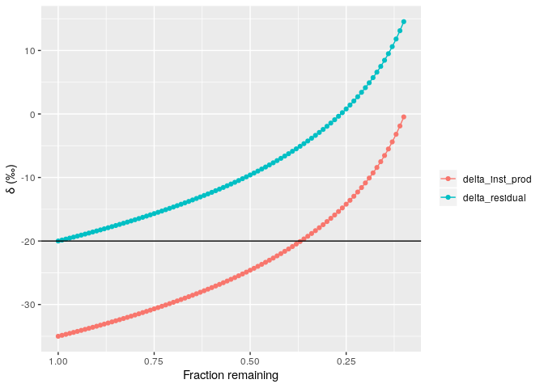

<!-- README.md is generated from README.Rmd. Please edit that file -->
rayleigh
========

The goal of rayleigh is to generate Rayleigh isotope curves.

Installation
------------

You can install the released version of rayleigh from [GitHub](https://github.com/biogeochem/rayleigh) with:

``` r
devtools::install_github("biogeochem/rayleigh")
```

Example
-------

This is a basic example where the initial δ value is -20‰ and the ε is -15‰:

``` r
calc_rayleigh(-20, -15)
#>    fraction_remaining       delta
#> 1                0.10  14.5387764
#> 2                0.15   8.4567998
#> 3                0.20   4.1415687
#> 4                0.25   0.7944154
#> 5                0.30  -1.9404079
#> 6                0.35  -4.2526681
#> 7                0.40  -6.2556390
#> 8                0.45  -8.0223846
#> 9                0.50  -9.6027923
#> 10               0.55 -11.0324450
#> 11               0.60 -12.3376156
#> 12               0.65 -13.5382563
#> 13               0.70 -14.6498758
#> 14               0.75 -15.6847689
#> 15               0.80 -16.6528467
#> 16               0.85 -17.5622161
#> 17               0.90 -18.4195923
#> 18               0.95 -19.2306006
#> 19               1.00 -20.0000000
```

The resulting `data.frame` can be plotted:

``` r
plot_rayleigh(calc_rayleigh(-20, -15))
```



Note that the `plot_rayleigh` function returns a `ggplot` object so it is easy to modify:

``` r
x <- plot_rayleigh(calc_rayleigh(-20, -15))
x + theme_bw()
```


