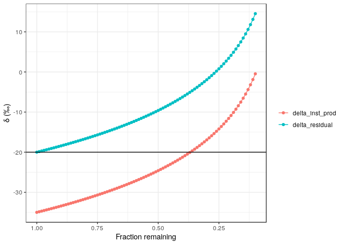

<!-- README.md is generated from README.Rmd. Please edit that file -->

# rayleigh 

The goal of rayleigh is to generate Rayleigh isotope curves.

## Installation

You can install the released version of rayleigh from
[GitHub](https://github.com/biogeochem/rayleigh) with:

``` r
devtools::install_github("biogeochem/rayleigh")
```

## Example

This is a basic example where the initial δ value is -20‰ and the ε is
-15‰:

``` r
library(rayleigh)
calc_rayleigh(-20, -15)
#>    fraction_remaining delta_residual delta_inst_prod
#> 1                0.10     14.5387764      -0.4612236
#> 2                0.11     13.1091237      -1.8908763
#> 3                0.12     11.8039530      -3.1960470
#> 4                0.13     10.6033124      -4.3966876
#> 5                0.14      9.4916928      -5.5083072
#> 6                0.15      8.4567998      -6.5432002
#> 7                0.16      7.4887220      -7.5112780
#> 8                0.17      6.5793526      -8.4206474
#> 9                0.18      5.7219764      -9.2780236
#> 10               0.19      4.9109681     -10.0890319
#> 11               0.20      4.1415687     -10.8584313
#> 12               0.21      3.4097162     -11.5902838
#> 13               0.22      2.7119160     -12.2880840
#> 14               0.23      2.0451396     -12.9548604
#> 15               0.24      1.4067453     -13.5932547
#> 16               0.25      0.7944154     -14.2055846
#> 17               0.26      0.2061047     -14.7938953
#> 18               0.27     -0.3600002     -15.3600002
#> 19               0.28     -0.9055149     -15.9055149
#> 20               0.29     -1.4318847     -16.4318847
#> 21               0.30     -1.9404079     -16.9404079
#> 22               0.31     -2.4322553     -17.4322553
#> 23               0.32     -2.9084858     -17.9084858
#> 24               0.33     -3.3700606     -18.3700606
#> 25               0.34     -3.8178551     -18.8178551
#> 26               0.35     -4.2526681     -19.2526681
#> 27               0.36     -4.6752313     -19.6752313
#> 28               0.37     -5.0862159     -20.0862159
#> 29               0.38     -5.4862396     -20.4862396
#> 30               0.39     -5.8758719     -20.8758719
#> 31               0.40     -6.2556390     -21.2556390
#> 32               0.41     -6.6260282     -21.6260282
#> 33               0.42     -6.9874915     -21.9874915
#> 34               0.43     -7.3404489     -22.3404489
#> 35               0.44     -7.6852917     -22.6852917
#> 36               0.45     -8.0223846     -23.0223846
#> 37               0.46     -8.3520682     -23.3520682
#> 38               0.47     -8.6746612     -23.6746612
#> 39               0.48     -8.9904624     -23.9904624
#> 40               0.49     -9.2997517     -24.2997517
#> 41               0.50     -9.6027923     -24.6027923
#> 42               0.51     -9.8998317     -24.8998317
#> 43               0.52    -10.1911030     -25.1911030
#> 44               0.53    -10.4768259     -25.4768259
#> 45               0.54    -10.7572079     -25.7572079
#> 46               0.55    -11.0324450     -26.0324450
#> 47               0.56    -11.3027226     -26.3027226
#> 48               0.57    -11.5682162     -26.5682162
#> 49               0.58    -11.8290924     -26.8290924
#> 50               0.59    -12.0855089     -27.0855089
#> 51               0.60    -12.3376156     -27.3376156
#> 52               0.61    -12.5855552     -27.5855552
#> 53               0.62    -12.8294630     -27.8294630
#> 54               0.63    -13.0694681     -28.0694681
#> 55               0.64    -13.3056935     -28.3056935
#> 56               0.65    -13.5382563     -28.5382563
#> 57               0.66    -13.7672683     -28.7672683
#> 58               0.67    -13.9928365     -28.9928365
#> 59               0.68    -14.2150628     -29.2150628
#> 60               0.69    -14.4340448     -29.4340448
#> 61               0.70    -14.6498758     -29.6498758
#> 62               0.71    -14.8626454     -29.8626454
#> 63               0.72    -15.0724390     -30.0724390
#> 64               0.73    -15.2793388     -30.2793388
#> 65               0.74    -15.4834236     -30.4834236
#> 66               0.75    -15.6847689     -30.6847689
#> 67               0.76    -15.8834473     -30.8834473
#> 68               0.77    -16.0795285     -31.0795285
#> 69               0.78    -16.2730796     -31.2730796
#> 70               0.79    -16.4641650     -31.4641650
#> 71               0.80    -16.6528467     -31.6528467
#> 72               0.81    -16.8391845     -31.8391845
#> 73               0.82    -17.0232359     -32.0232359
#> 74               0.83    -17.2050563     -32.2050563
#> 75               0.84    -17.3846992     -32.3846992
#> 76               0.85    -17.5622161     -32.5622161
#> 77               0.86    -17.7376567     -32.7376567
#> 78               0.87    -17.9110690     -32.9110690
#> 79               0.88    -18.0824994     -33.0824994
#> 80               0.89    -18.2519928     -33.2519928
#> 81               0.90    -18.4195923     -33.4195923
#> 82               0.91    -18.5853398     -33.5853398
#> 83               0.92    -18.7492759     -33.7492759
#> 84               0.93    -18.9114396     -33.9114396
#> 85               0.94    -19.0718689     -34.0718689
#> 86               0.95    -19.2306006     -34.2306006
#> 87               0.96    -19.3876701     -34.3876701
#> 88               0.97    -19.5431119     -34.5431119
#> 89               0.98    -19.6969594     -34.6969594
#> 90               0.99    -19.8492450     -34.8492450
#> 91               1.00    -20.0000000     -35.0000000
```

The resulting `data.frame` can be plotted:

``` r
plot_rayleigh(calc_rayleigh(-20, -15))
```


Note that the `plot_rayleigh` function returns a `ggplot` object so it
is easy to modify:

``` r
x <- plot_rayleigh(calc_rayleigh(-20, -15))
x + ggplot2::theme_bw()
```


